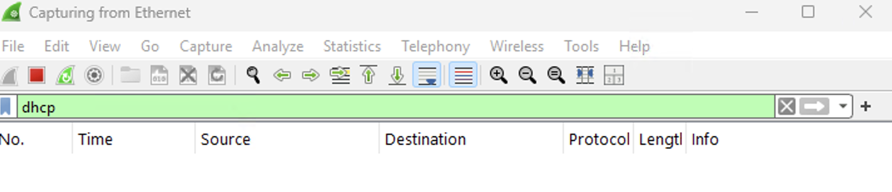

# Observing SSH & DHCP Traffic Using Wireshark & PowerShell in Windows VM

## Part 1: Observe SSH Traffic

### Step 1: Start VMs and Ensure they are Running
- Open Azure and start VMs  
- Open Microsoft Remote Desktop and login to your Windows VM

### Step 2: Observe SSH Traffic
- Open Wireshark  
- Begin packet capture on the appropriate Ethernet interface

### Step 3: Apply SSH Filter
In Wireshark’s filter bar, type:

```
ssh
```
Press Enter to apply the filter.


### Step 4: SSH into the Ubuntu VM
- Open PowerShell as Administrator on the Windows VM  
- Enter the SSH command:

```
ssh labuser@10.0.0.5
```


### Step 5: Accept Host Key and Authenticate
- When prompted, type `yes` to accept the fingerprint  
- Enter the password for `labuser`  
- Notice that with every entry, there is SSH traffic


### Step 6: Observe SSH Traffic
Now that we are in the Ubuntu VM, we can begin to observe more SSH traffic.


### Step 7: Execute Linux Commands
Once connected to the Ubuntu VM, type the following:
```
hostname
id
uname -a
touch file.txt
```
This will create a file.

Observe that with every keystroke, there is SSH traffic.


### Step 8: Observe SSH Packet Activity in Wireshark
In the Wireshark filter bar, type:
```
tcp.port == 22
```
SSH uses TCP port 22.  
Observe the live stream of encrypted packets during the SSH session.



### Step 9: Exit the SSH Session
In PowerShell, type:
```
exit
```
Confirm the session closes and SSH traffic stops.


---

## Part 2: Observe DHCP Traffic

### Step 1: Filter for DHCP Traffic in Wireshark
In Wireshark’s filter bar, type:
```
dhcp
```
Press Enter.


### Step 2: Release & Renew IP Address via PowerShell
Open PowerShell as Administrator.  
Run the following:
```
ipconfig /renew
```


### Step 3: Automate IP Renewal with a Batch Script (Optional)
Open Notepad and type:
```
ipconfig /release
ipconfig /renew
```
Save the file as `dhcp.bat` in:
```
C:\ProgramData
```


### Step 4: Navigate to Batch Script Location
In PowerShell, type:
```
cd C:\ProgramData
ls
```


### Step 5: Run the Script to Trigger DHCP Events
Execute the script in PowerShell:
```
.\dhcp.bat
```


### Step 6: Observe DHCP Traffic in Wireshark
In Wireshark, observe the following:
- DHCP Discover  
- DHCP Offer  
- DHCP Request  
- DHCP ACK


### Step 7: Handle Temporary Disconnection
If connection drops briefly after IP release, you may see a message like:
> "Connection lost…" (temporary during IP renewal)
