# Observing SSH & DHCP Traffic Using Wireshark & PowerShell in Windows VM

## Part 1: Observe SSH Traffic

### Step 1: Start VMs and Ensure They Are Running
- Open Azure and start the VMs.
- Open Microsoft Remote Desktop and log in to your Windows VM.

### Step 2: Observe SSH Traffic
- Open Wireshark.
- Begin packet capture on the appropriate Ethernet interface.

### Step 3: Apply SSH Filter
In Wireshark’s filter bar, type:

```bash
ssh
```

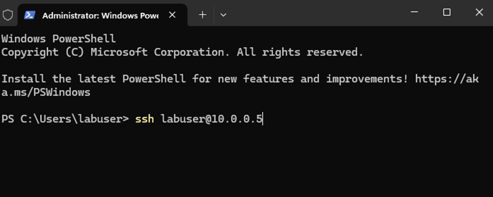

### Step 4: SSH into the Ubuntu VM
Open PowerShell as Administrator on the Windows VM and enter:

```bash
ssh labuser@10.0.0.5
```


### Step 5: Accept Host Key and Authenticate
- Type `yes` when prompted to accept the fingerprint.
- Enter the password for `labuser`.

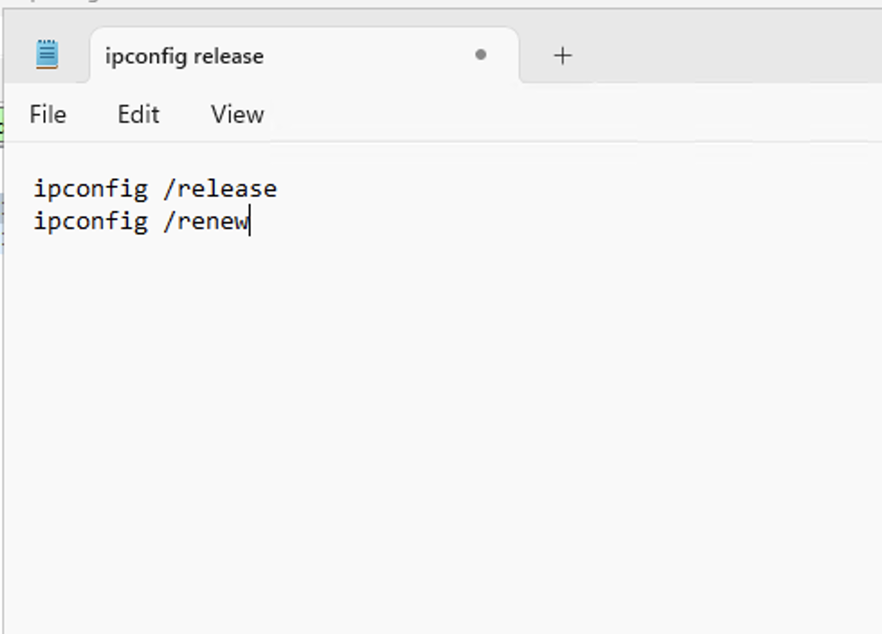

### Step 6: Observe SSH Traffic
- With every keystroke, you will see SSH packets in Wireshark.

### Step 7: Execute Linux Commands
On the Ubuntu VM, run:

```bash
hostname
id
uname -a
touch file.txt
```

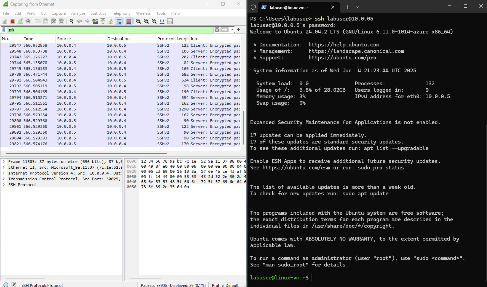

### Step 8: Observe SSH Packet Activity
In Wireshark filter bar, type:

```bash
tcp.port == 22
```

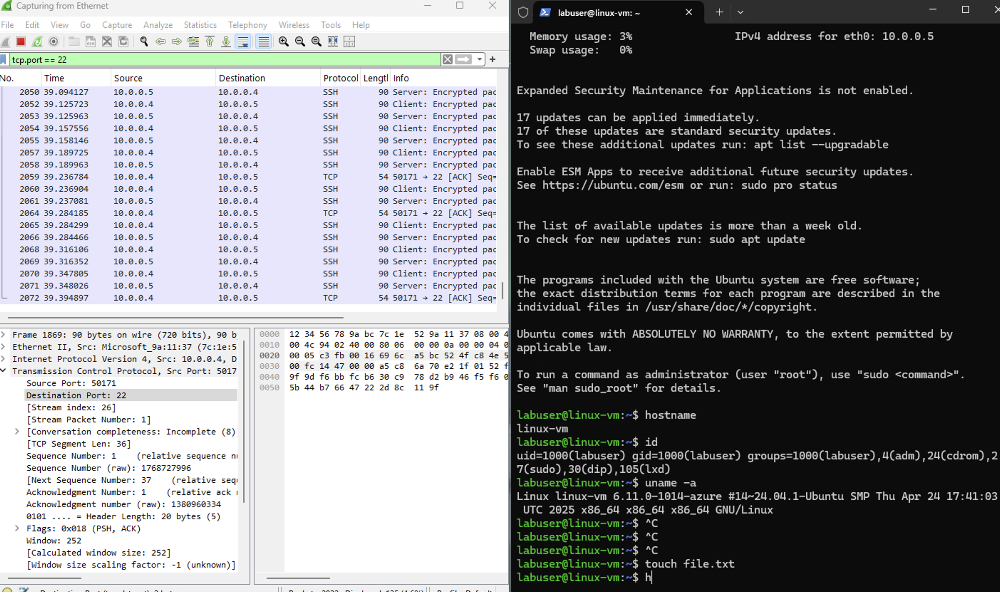


### Step 9: Exit the SSH Session
Type:

```bash
exit
```

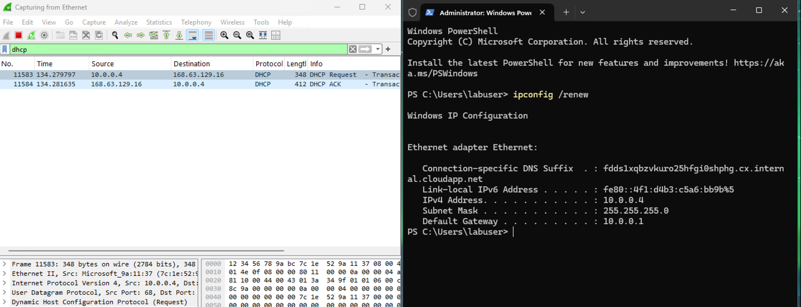

---

## Part 2: Observe DHCP Traffic

### Step 1: Filter for DHCP in Wireshark
In the Wireshark filter bar, type:

```bash
dhcp
```

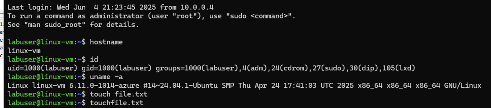

### Step 2: Release & Renew IP via PowerShell
Open PowerShell as Administrator:

```bash
ipconfig /renew
```

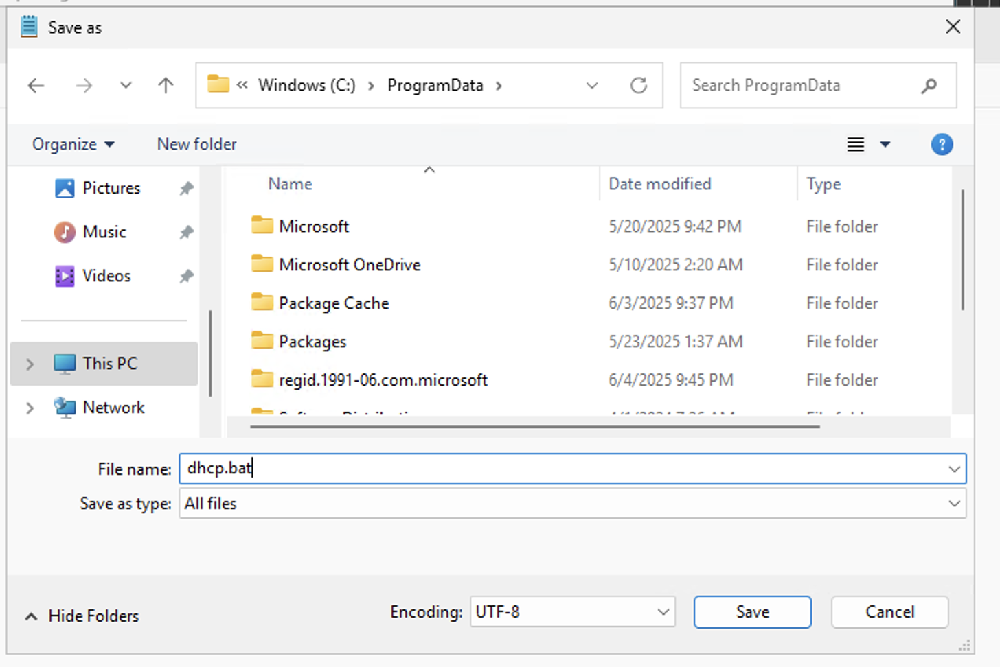

### Step 3: Automate IP Renewal with Batch Script (Optional)
Create a `.bat` file with:

```bash
ipconfig /release
ipconfig /renew
```

Save it as `dhcp.bat` under `C:\ProgramData`.

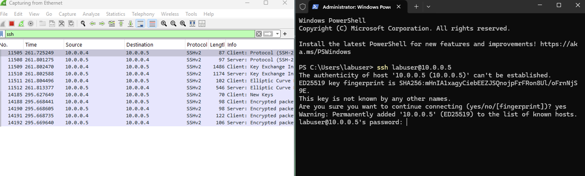

### Step 4: Navigate to Batch Script
In PowerShell:

```bash
cd C:\ProgramData
ls
```

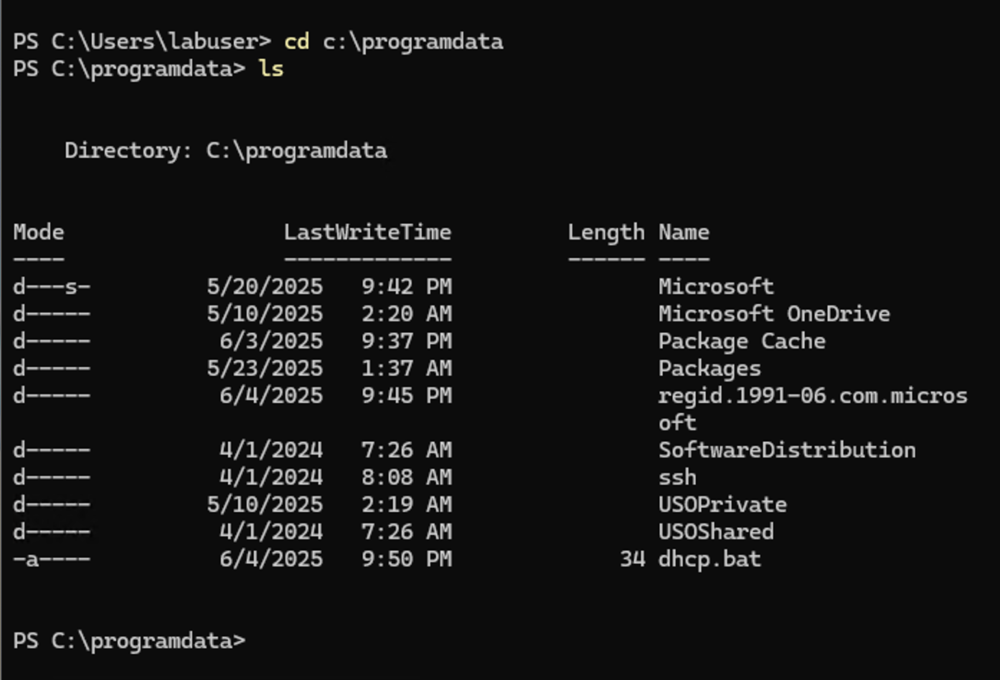

### Step 5: Run the Script to Trigger DHCP Events

```bash
.\dhcp.bat
```

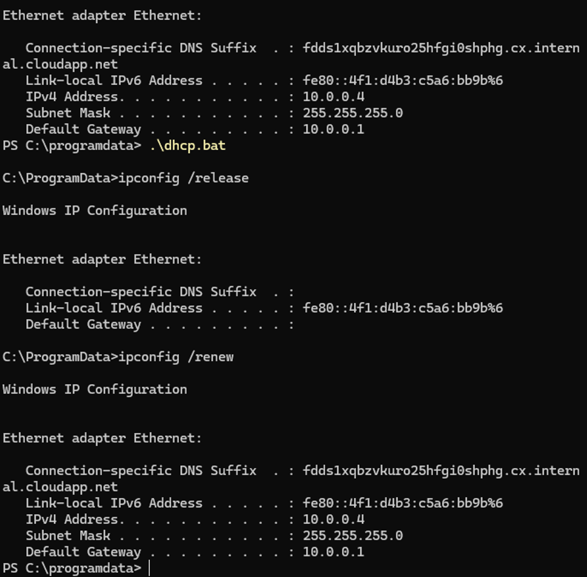

### Step 6: Observe DHCP Traffic in Wireshark
You should see:
- DHCP Discover
- DHCP Offer
- DHCP Request
- DHCP ACK

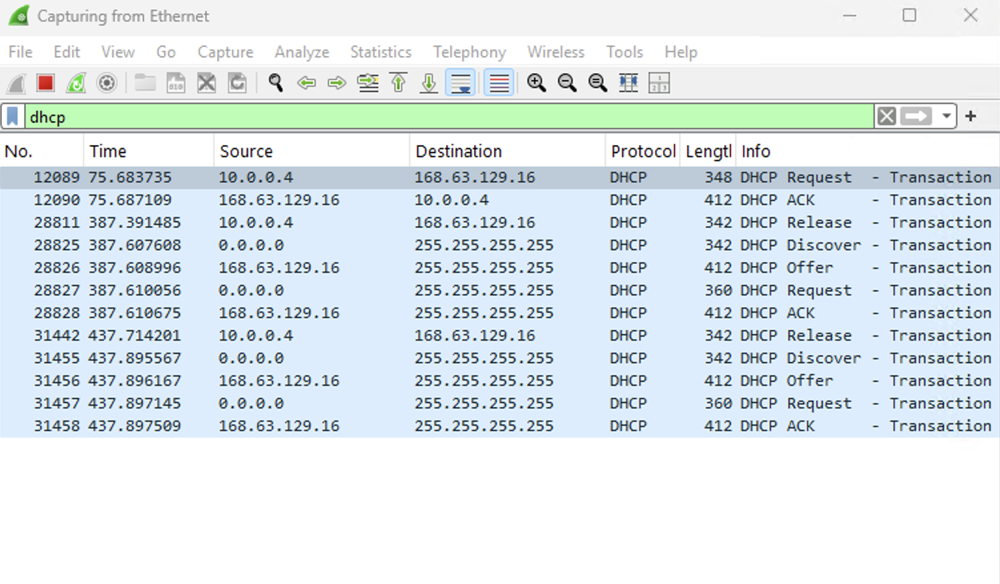

### Step 7: Handle Temporary Disconnection
- If the connection briefly drops, you may see a reconnection message.

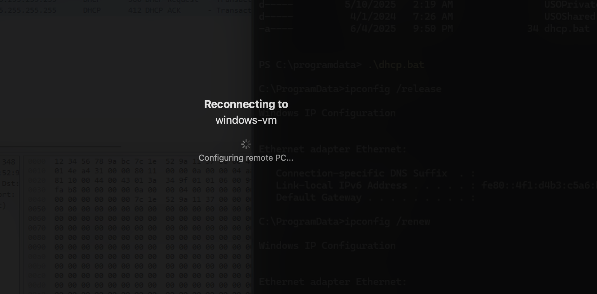
