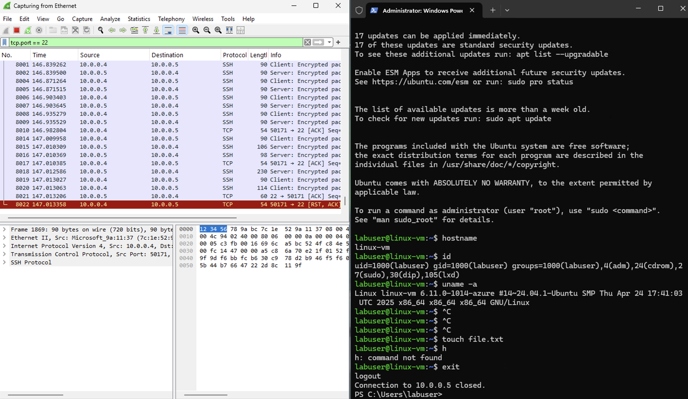

Observing SSH & DHCP Traffic Using Wireshark & PowerShell in Windows VM

Part 1: Observe ssh Traffic

Step 1: 	Start VMs and Ensure they are Running

Open Azure and start VMs

Open Microsoft Remote Desktop and login to your Windows VM

Step 2:	Observe SSH Traffic

Open Wireshark.

Begin packet capture on the appropriate Ethernet interface.

Step 3: 	Apply SSH Filter

In Wireshark’s filter bar, type:
ssh

Press Enter to apply the filter.

Step 4: 	SSH into the Ubuntu VM

Open PowerShell as Administrator on the Windows VM.

Enter the SSH command:

ssh <username>@<Private IP Address>

ssh labuser@10.0.0.5

Step 5: 	Accept Host Key and Authenticate

When prompted, type yes to accept the fingerprint.

Enter the password for labuser.

Notice that with every entry there is ssh traffic.

Step 6: 	Observe ssh Traffic

Now that we are in the ubuntu vm we can begin to observe more ssh traffic.

Step 7: 	Execute Linux Commands

Once connected to the Ubuntu VM, type the following:

hostname

id

uname -a

touch file.txt this will create a file

Observe that with every key stroke there is ssh traffic

Step 8: Observe SSH Packet Activity in Wireshark

In the Wireshark filter type:
tcp.port == 22

ssh uses TCP port 22

Observe the live stream of encrypted packets during the SSH session.

Step 9: Exit the SSH Session

In PowerShell type:
exit

Confirm the session closes and SSH traffic stops.

Part 2: Observe DHCP Traffic

Step 1: Filter for DHCP Traffic in Wireshark

In Wireshark’s filter bar, type:
dhcp

Press Enter.

Step 2: Release & Renew IP Address via PowerShell

Open PowerShell as Administrator.

Run the following in PowerShell:

ipconfig /renew

Step 3: Automate IP Renewal with a Batch Script (Optional)

Open Notepad and type:
ipconfig /release

ipconfig /renew

Save the file as: dhcp.bat

Save it in: C: \ProgramData

Step 4: Navigate to Batch Script Location

In PowerShell type:
cd C: \ProgramData

ls

Step 5: Run the Script to Trigger DHCP Events

Execute the script in PowerShell:
.\dhcp.bat

Step 6: Observe DHCP Traffic in Wireshark

In Wireshark, observe the following:

DHCP Discover

DHCP Offer

DHCP Request

DHCP ACK

Step 7: Handle Temporary Disconnection

If connection drops briefly after IP release, you may see a message like: