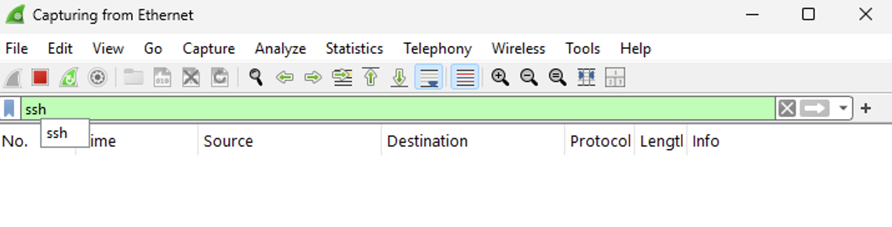

# Observing SSH & DHCP Traffic Using Wireshark & PowerShell in Windows VM

---

## Part 1: Observe SSH Traffic

---

### Step 1: Start VMs and Ensure They Are Running

- Open Azure and start both VMs.
- Open Microsoft Remote Desktop and log in to your Windows VM.

---

### Step 2: Observe SSH Traffic

- Open **Wireshark**.
- Begin packet capture on the appropriate Ethernet interface.



---

### Step 3: Apply SSH Filter

- In Wireshark’s filter bar, type:
  ```
  ssh
  ```
- Press Enter to apply the filter.


---

### Step 4: SSH into the Ubuntu VM

- Open **PowerShell as Administrator** on the Windows VM.
- Enter the SSH command:
  ```
  ssh labuser@10.0.0.5
  ```


---

### Step 5: Accept Host Key and Authenticate

- When prompted, type `yes` to accept the fingerprint.
- Enter the password for `labuser`.
- Notice that with every entry, there is SSH traffic.


---

### Step 6: Observe SSH Traffic

- Now that you are in the Ubuntu VM, observe the SSH traffic generated.


---

### Step 7: Execute Linux Commands

- Type the following commands:
  ```
  hostname
  id
  uname -a
  touch file.txt
  ```
- Each keystroke and command triggers SSH traffic.


---

### Step 8: Observe SSH Packet Activity in Wireshark

- In the Wireshark filter, type:
  ```
  tcp.port == 22
  ```
- SSH uses **TCP port 22**.
- Observe the encrypted packets during the session.


---

### Step 9: Exit the SSH Session

- In PowerShell, type:
  ```
  exit
  ```
- Confirm the session closes and SSH traffic stops.


---

## Part 2: Observe DHCP Traffic

---

### Step 1: Filter for DHCP Traffic in Wireshark

- In Wireshark’s filter bar, type:
  ```
  dhcp
  ```
- Press Enter.


---

### Step 2: Release & Renew IP Address via PowerShell

- Open PowerShell as Administrator.
- Run the command:
  ```
  ipconfig /renew
  `
